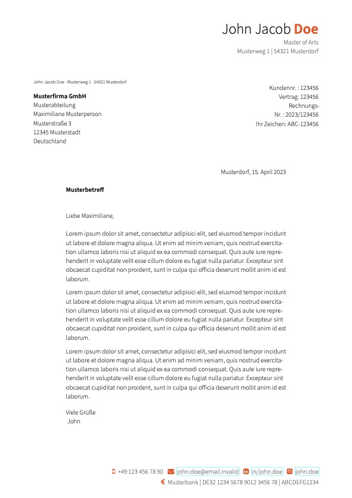

# German Letter Template for LaTeX.

This is a clean and modern LaTeX template for German formal letters that follows roughly DIN 5008. It's primarily based on [Jan Mattfeld's](https://github.com/ljanmattfeld) awesome [template](https://github.com/janmattfeld/latex-briefvorlage).

I only use another color pattern that matches perfectly with the dark scheme of the hipster cv.

## Features

* Clean and modern look
* Well structured and commented
* Easily extensible and adjustable
* Based on [scrlttr2](https://ctan.org/pkg/scrlttr2)
* Looks well on screen and print
* Fits windowed envelopes
* Can be used even with little knowledge of LaTeX
* Fits windowed envelopes
* Comes with lots of contact details
* Different styles (formal, informal, German "Du")

## How does it work?

The template is designed to be used easily by LaTeX beginners. Simply change the contents of the file [letter-content.lco](./content/letter-content.lco) for the desired adressee and your writing as well as of the file [sender-dummy.lco](./senders/sender-dummy.lco) for your contact details and sender information. The letter will be build upon your settings automatically. Images of your signature can be provided in the subfolder "images.

## How it's look like

## Contributing

Do you want to contribute? That’s great! Contributions are always welcome, no matter how large or small. If you found something odd, feel free to [submit a new issue](https://github.com/cypr0/latex-letter-template/issues/), improve the code by [creating a pull request](https://github.com/cypr0/latex-letter-template/pulls/), or by [sponsoring this project](https://github.com/sponsors/cypr0/).